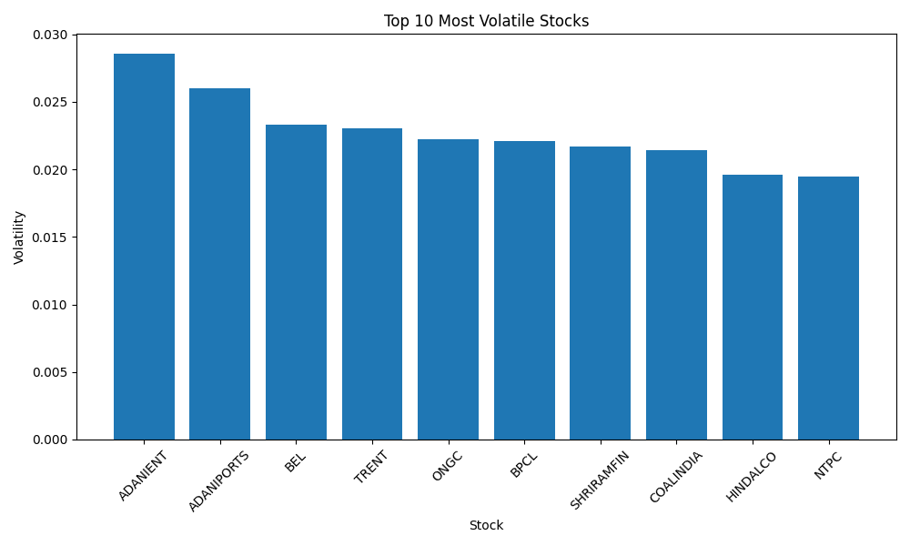
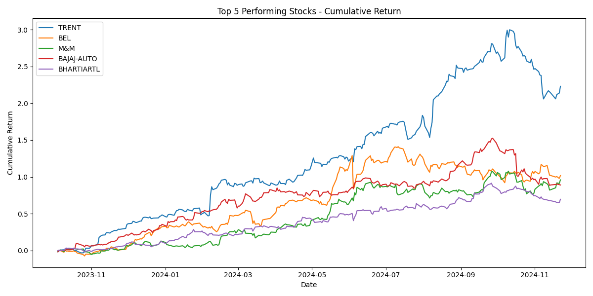
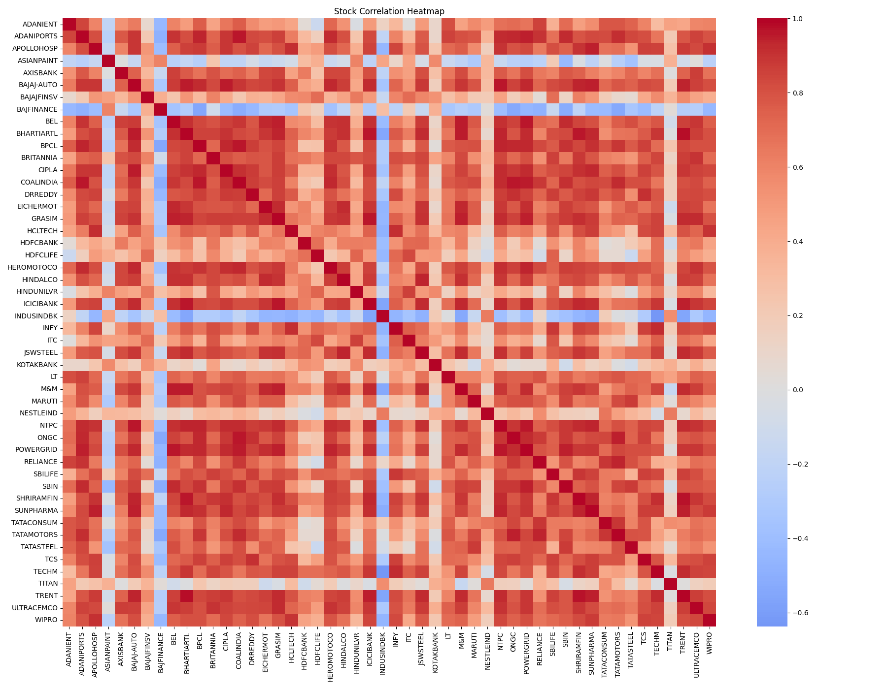
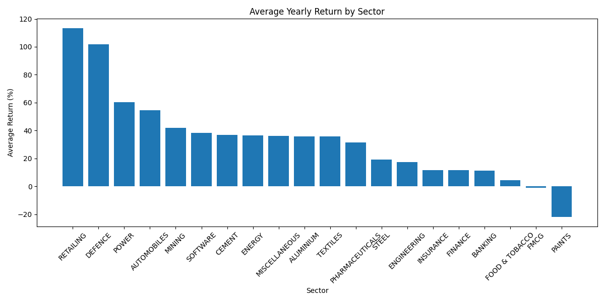

# 📈 Stock Market Analysis Dashboard

## Project Overview

This project analyzes NIFTY 50 stock data using Python, SQLite, Streamlit, and Power BI.

The objective is to organize, clean, analyze, and visualize stock market data to identify market trends, top-performing stocks, volatility patterns, sector performance, and investment insights.

---

## Features

- Data Cleaning & Transformation
- YAML to CSV Conversion
- Market Summary Analysis
- Top 10 Green Stocks Analysis
- Top 10 Loss Stocks Analysis
- Volatility Analysis
- Cumulative Return Analysis
- Sector-wise Performance Analysis
- Stock Correlation Analysis
- Monthly Gainers & Losers Analysis
- SQLite Database Integration
- Interactive Streamlit Dashboard
- Power BI Dashboard

---

## Technologies Used

- Python
- Pandas
- NumPy
- Matplotlib
- Seaborn
- SQLite
- Streamlit
- Power BI
- YAML

---

## Project Structure

```text
Stock_Analysis_Project/
│
├── csv_data/
├── data/
├── database/
│   ├── analysis_results/
│   ├── stock_analysis.db
│
├── images/
│   ├── volatility_chart.png
│   ├── cumulative_return_chart.png
│   ├── correlation_heatmap.png
│   └── sector_performance_chart.png
│
├── notebooks/
├── powerbi/
│
├── scripts/
│   ├── yaml_to_csv.py
│   ├── data_cleaning.py
│   ├── analysis.py
│   ├── volatility_analysis.py
│   ├── cumulative_return.py
│   ├── sector_analysis.py
│   ├── correlation_heatmap.py
│   ├── monthly_gainers_losers.py
│   └── database_setup.py
│
├── streamlit_app/
│   └── app.py
│
├── README.md
└── requirements.txt
```

---

## Project Workflow

1. Extract stock data from YAML files.
2. Convert YAML files into CSV format.
3. Clean and preprocess stock data.
4. Generate market summary statistics.
5. Identify Top 10 Green Stocks.
6. Identify Top 10 Loss Stocks.
7. Calculate stock volatility.
8. Calculate cumulative returns.
9. Perform sector-wise analysis.
10. Generate stock correlation matrix.
11. Analyze monthly gainers and losers.
12. Store processed data in SQLite database.
13. Build interactive Streamlit dashboard.
14. Create Power BI dashboard for visualization.

---

## Analysis Performed

### Market Summary

- Number of Green Stocks
- Number of Red Stocks
- Average Stock Price
- Average Trading Volume

### Volatility Analysis

- Daily Return Calculation
- Standard Deviation of Returns
- Top 10 Most Volatile Stocks

### Cumulative Return Analysis

- Top 5 Performing Stocks
- Growth Comparison Across Stocks

### Sector Performance Analysis

- Sector Classification
- Average Yearly Return by Sector

### Correlation Analysis

- Stock Price Correlation Matrix
- Heatmap Visualization

### Monthly Analysis

- Top Monthly Gainers
- Top Monthly Losers

---

## Screenshots

### Top 10 Most Volatile Stocks



---

### Top 5 Performing Stocks



---

### Stock Correlation Heatmap



---

### Sector Performance Analysis



---

## Database Integration

SQLite database is used to store processed stock data.

Database File:

```text
database/stock_analysis.db
```

---

## How To Run

### Clone Repository

```bash
git clone https://github.com/YourUsername/Stock_Market_Analysis_Dashboard.git
```

### Install Dependencies

```bash
pip install -r requirements.txt
```

### Run Data Cleaning

```bash
python scripts/data_cleaning.py
```

### Run Market Analysis

```bash
python scripts/analysis.py
```

### Run Volatility Analysis

```bash
python scripts/volatility_analysis.py
```

### Run Cumulative Return Analysis

```bash
python scripts/cumulative_return.py
```

### Run Sector Analysis

```bash
python scripts/sector_analysis.py
```

### Run Correlation Analysis

```bash
python scripts/correlation_heatmap.py
```

### Run Monthly Gainers & Losers Analysis

```bash
python scripts/monthly_gainers_losers.py
```

### Create Database

```bash
python scripts/database_setup.py
```

### Launch Streamlit Dashboard

```bash
python -m streamlit run streamlit_app/app.py
```

---

## Results

- Top 10 Best Performing Stocks Identified
- Top 10 Worst Performing Stocks Identified
- Market Performance Summarized
- Volatility Measured for All Stocks
- Sector-wise Performance Evaluated
- Correlation Analysis Completed
- Monthly Gainers & Losers Identified
- Interactive Dashboard Developed

---

## Future Enhancements

- Real-time Stock Data Integration
- Machine Learning Based Stock Prediction
- Advanced Portfolio Analysis
- Cloud Deployment

---

## Author

**Tania Banerjee**

Data Analytics Project

---

## License

This project is created for educational and portfolio purposes.
