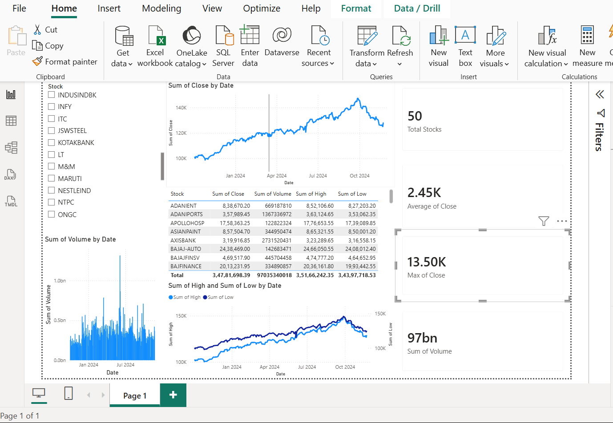
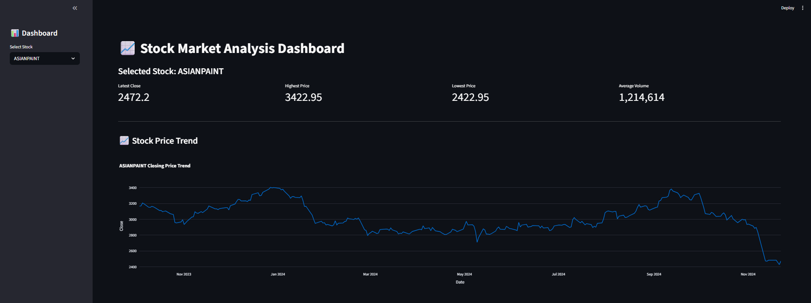
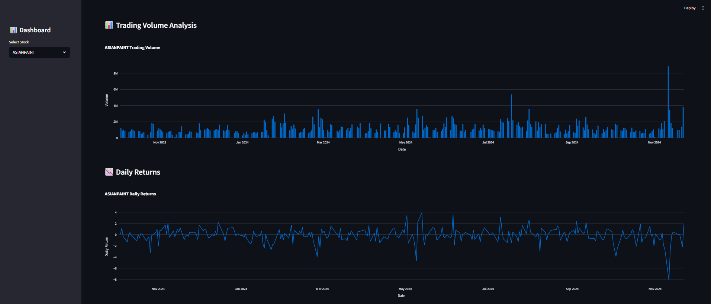

# 📈 Stock Market Analysis Project

## Overview

This project is an end-to-end Stock Market Analysis solution built using Python, SQL, Streamlit, and Power BI. It analyzes historical stock market data, identifies trends, evaluates sector performance, measures volatility, and presents insights through interactive dashboards and visualizations.

---

## 🎯 Project Objectives

- Analyze historical stock performance
- Compare stock returns
- Evaluate sector-wise performance
- Measure stock volatility
- Build interactive dashboards
- Generate actionable insights from financial data

---

## 🛠️ Technologies Used

- Python
- Pandas
- NumPy
- Matplotlib
- Seaborn
- SQLite
- SQL
- Streamlit
- Power BI
- Git & GitHub

---

## 📂 Project Structure

```text
Stock_Analysis_Project/
│
├── csv_data/
├── data/
├── database/
├── images/
├── notebooks/
├── scripts/
├── streamlit_app/
│
├── powerbi/
│   ├── stock_market_dashboard.pbix
│   └── screenshots/
│       └── dashboard_powerbi.png
│
├── app.py
├── README.md
└── requirements.txt
```

---

# 📊 Power BI Dashboard

Interactive Power BI dashboard built using stock market data.

### Features

- Total Stocks Tracked
- Average Closing Price
- Maximum Closing Price
- Trading Volume Analysis
- High vs Low Price Comparison
- Interactive Stock Filtering
- Executive KPI Dashboard

### Dashboard Preview



---

# 🌐 Streamlit Dashboard

Interactive web application built using Streamlit for stock market exploration and analysis.

### Features

- Interactive Stock Selection
- Historical Price Analysis
- Volume Analysis
- Dynamic Filtering
- Real-Time Visualization

### Dashboard Overview



### Price Trend Analysis



---

# 📈 Advanced Stock Analysis Visualizations

### Sector Performance Analysis

Comparison of average yearly returns across different sectors.


---

### Top Performing Stocks

Analysis of cumulative returns to identify the best-performing stocks.


---

### Volatility Analysis

Comparison of stock volatility and market risk.


---

### Stock Correlation Heatmap

Visualization showing relationships between stock movements.


---

## 🗄️ Database

The project stores cleaned and processed stock data in SQLite.

Database File:

```text
database/stock_analysis.db
```

---

## 📋 Key Insights

- High-performing stocks were identified using cumulative return analysis.
- Sector-wise performance varies significantly.
- Trading volume spikes often coincide with major price movements.
- Correlation analysis helps identify diversification opportunities.
- Volatility analysis highlights risk differences among stocks.

---

## 🚀 How to Run

### Install Dependencies

```bash
pip install -r requirements.txt
```

### Run Streamlit Dashboard

```bash
streamlit run streamlit_app/app.py
```

### Open Power BI Dashboard

Open:

```text
powerbi/stock_market_dashboard.pbix
```

using Power BI Desktop.

---

## 🔮 Future Enhancements

- Real-time stock market integration
- Machine Learning price prediction
- Portfolio optimization
- Advanced financial indicators
- Automated reporting

---

## 👩‍💻 Author

**Tania Banerjee**

Data Analytics | Python | SQL | Power BI | Streamlit
