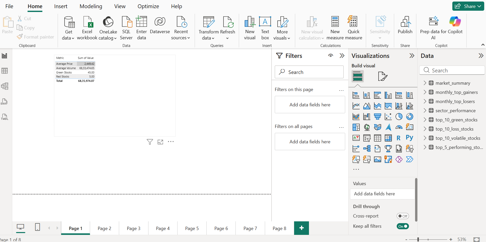
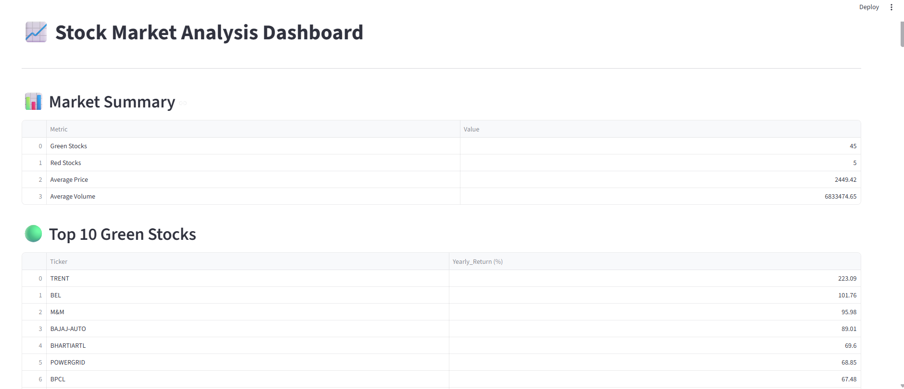

# 📈 Stock Market Analysis Dashboard

## 📌 Project Overview

This project is a complete Stock Market Analysis Dashboard built using Python, SQLite, Streamlit, and Power BI.

The project performs:

- Data cleaning and preprocessing
- Stock return analysis
- Volatility analysis
- Correlation analysis
- Sector performance analysis
- Monthly gainers and losers identification
- Interactive dashboard visualization
- Power BI reporting

---

## 🛠️ Technologies Used

- Python
- Pandas
- NumPy
- Matplotlib
- Seaborn
- SQLite
- Streamlit
- Power BI

---

## 📂 Project Structure

```
Stock_Analysis_Project/
│
├── csv_data/
├── database/
│   ├── analysis_results/
│   ├── cleaning_summary.csv
│   └── stock_analysis.db
│
├── images/
│
├── powerbi/
│   └── Stock_Market_Analysis.pbix
│
├── scripts/
│   ├── yaml_to_csv.py
│   ├── data_cleaning.py
│   ├── analysis.py
│   ├── volatility_analysis.py
│   ├── cumulative_return.py
│   ├── sector_analysis.py
│   ├── correlation_heatmap.py
│   ├── monthly_gainers_losers.py
│   └── database_setup.py
│
├── streamlit_app/
│   └── app.py
│
├── README.md
└── requirements.txt
```

---

## 📊 Power BI Dashboard

### Market Summary Dashboard



---

## 📈 Analysis Visualizations

### Correlation Heatmap


### Cumulative Return Analysis


### Sector Performance Analysis


### Volatility Analysis


---

## 🌐 Streamlit Dashboard



---

## 🚀 How To Run

### Clone Repository

```bash
git clone https://github.com/Tania94-hub/Stock-Market-Analysis-Dashboard.git
cd Stock-Market-Analysis-Dashboard
```

### Install Dependencies

```bash
pip install -r requirements.txt
```

### Run Data Cleaning

```bash
python scripts/data_cleaning.py
```

### Run Analysis Scripts

```bash
python scripts/analysis.py
python scripts/volatility_analysis.py
python scripts/cumulative_return.py
python scripts/sector_analysis.py
python scripts/correlation_heatmap.py
python scripts/monthly_gainers_losers.py
```

### Launch Streamlit Dashboard

```bash
streamlit run streamlit_app/app.py
```

---

## 📌 Features

- Stock Performance Tracking
- Sector-wise Analysis
- Correlation Heatmap
- Volatility Measurement
- Monthly Top Gainers
- Monthly Top Losers
- Interactive Streamlit Dashboard
- Power BI Reporting Dashboard

---

## 👩‍💻 Author

**Tania Banerjee**

GitHub:
https://github.com/Tania94-hub

---
